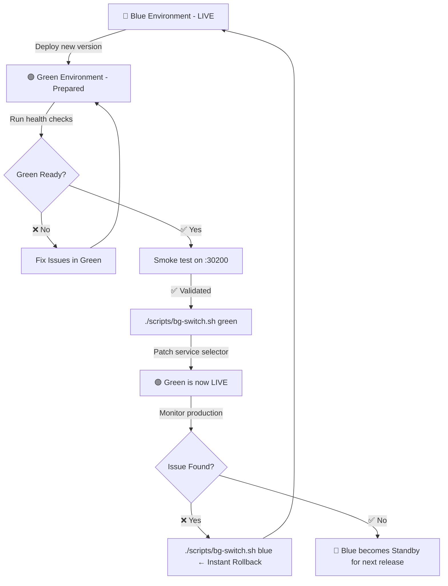

# 🔵🟢 Blue-Green Deployment Project

A production-grade **Blue-Green Deployment** implementation using **Node.js**, **Docker**, and **Kubernetes (Minikube)**. This project demonstrates zero-downtime deployments by maintaining two live environments and switching traffic between them atomically.

---

## 📋 Table of Contents

- [Project Structure](#-project-structure)
- [Prerequisites](#-prerequisites)
- [Project Setup & Local Development](#-project-setup--local-development)
- [Docker Containerization](#-docker-containerization)
- [Kubernetes Deployment](#-kubernetes-deployment)
- [Blue-Green Deployment Strategy](#-blue-green-deployment-strategy)
- [Switching Between Blue and Green](#-switching-between-blue-and-green)
- [Screenshots](#-screenshots)
- [Challenges & Solutions](#-challenges--solutions)
- [Cleanup](#-cleanup)

---

## 📁 Project Structure

```
Blue-green-Deployment/
├── backend/                        # Node.js REST API (MongoDB)
│   ├── server.js
│   ├── routes/
│   ├── models/
│   ├── Dockerfile
│   └── .dockerignore
│
├── frontend-blue/                  # Blue deployment (basic frontend)
│   ├── server.js
│   ├── public/
│   ├── Dockerfile
│   └── .dockerignore
│
├── frontend-green/                 # Green deployment (enhanced frontend)
│   ├── server.js
│   ├── public/
│   ├── Dockerfile
│   └── .dockerignore
│
├── k8s/                            # Kubernetes manifests
│   ├── namespace.yaml
│   ├── secret.yaml
│   ├── backend/
│   │   ├── deployment.yaml
│   │   └── service.yaml
│   ├── frontend-blue/
│   │   ├── deployment.yaml
│   │   └── service.yaml
│   ├── frontend-green/
│   │   ├── deployment.yaml
│   │   └── service.yaml
│   └── blue-green-switch/
│       ├── active-service.yaml     # Production service (NodePort :30000)
│       ├── patch-to-green.yaml     # Switch: Blue → Green
│       └── patch-to-blue.yaml     # Rollback: Green → Blue
│
├── scripts/
│   └── bg-switch.sh               # Blue-Green switch CLI tool
├── docker-compose.yml
├── BLUE_GREEN_STRATEGY.md
└── README.md
```

---

## ✅ Prerequisites

| Tool | Version Used | Purpose |
|------|-------------|---------|
| [Node.js](https://nodejs.org) | v18+ | Runtime for all services |
| [Docker Desktop](https://www.docker.com/products/docker-desktop) | v29.5+ | Container engine |
| [Minikube](https://minikube.sigs.k8s.io) | v1.39+ | Local Kubernetes cluster |
| kubectl | v1.37+ | Kubernetes CLI (bundled with Minikube) |
| Git | Any | Version control |

---

## 🚀 Project Setup & Local Development

### 1. Clone the Repository

```bash
git clone <your-repository-url>
cd Blue-green-Deployment
```

### 2. Backend Setup

```bash
cd backend
npm install
```

Create a `.env` file:
```env
PORT=5000
MONGO_URI=mongodb+srv://<username>:<password>@<cluster>.mongodb.net/<db>?retryWrites=true&w=majority
```

Start the backend:
```bash
npm start
# Server running at http://localhost:5000
# Health check: http://localhost:5000/health
```

### 3. Frontend Blue Setup

```bash
cd frontend-blue
npm install
```

Create a `.env` file:
```env
PORT=3100
```

Start frontend-blue:
```bash
npm start
# Accessible at http://localhost:3100
```

### 4. Frontend Green Setup

```bash
cd frontend-green
npm install
```

Start frontend-green:
```bash
PORT=3200 npm start
# Accessible at http://localhost:3200
```

---

## 🐳 Docker Containerization

### Build & Run with Docker Compose

```bash
# Build all images and start all services
docker compose up -d --build

# Verify all containers are running
docker compose ps

# Check health of all services
docker compose logs
```

### Individual Service Health Checks

```bash
curl http://localhost:5000/health   # Backend
curl http://localhost:3100/health   # Frontend Blue
curl http://localhost:3200/health   # Frontend Green
```

### Docker Commands Reference

```bash
# Stop all containers
docker compose down

# Rebuild a single service
docker compose up -d --build backend

# View logs for a service
docker compose logs -f frontend-blue
```

---

## ☸️ Kubernetes Deployment

### Step 1 — Install & Start Minikube

```bash
# Install via Homebrew (macOS)
brew install minikube

# Start Minikube using Docker as the driver
minikube start --driver=docker

# Confirm node is Ready
kubectl get nodes
# NAME       STATUS   ROLES           AGE   VERSION
# minikube   Ready    control-plane   60s   v1.37.0
```

### Step 2 — Load Docker Images into Minikube

> Since Minikube runs its own Docker daemon, local images must be loaded into it.

```bash
minikube image load bg-backend:latest
minikube image load bg-frontend-blue:latest
minikube image load bg-frontend-green:latest
```

### Step 3 — Apply All Kubernetes Manifests

```bash
# Create the namespace
kubectl apply -f k8s/namespace.yaml

# Create the secret (MONGO_URI)
kubectl apply -f k8s/secret.yaml

# Deploy backend
kubectl apply -f k8s/backend/

# Deploy frontend blue and green
kubectl apply -f k8s/frontend-blue/
kubectl apply -f k8s/frontend-green/

# Deploy the production active service
kubectl apply -f k8s/blue-green-switch/active-service.yaml
```

### Step 4 — Verify Deployment

```bash
# Check all pods are Running
kubectl get pods -n blue-green

# Check all services
kubectl get services -n blue-green

# Check deployments
kubectl get deployments -n blue-green

# Detailed pod health (probes)
kubectl describe pods -n blue-green
```

**Expected output:**
```
NAME                                        READY   STATUS    RESTARTS   AGE
backend-deployment-xxxxx                    1/1     Running   0          2m
backend-deployment-yyyyy                    1/1     Running   0          2m
frontend-blue-deployment-xxxxx              1/1     Running   0          2m
frontend-green-deployment-xxxxx             1/1     Running   0          2m
```

### Kubernetes Architecture

```
┌─────────────────────── Namespace: blue-green ───────────────────────────────┐
│                                                                              │
│  backend-deployment (2 replicas)   ←── ClusterIP :5000 (internal only)     │
│       ↑ MONGO_URI from K8s Secret                                           │
│                                                                              │
│  frontend-blue-deployment (1 pod)  ←── NodePort :30100  (direct access)    │
│  frontend-green-deployment (1 pod) ←── NodePort :30200  (direct access)    │
│                                                                              │
│  frontend-active-service           ←── NodePort :30000  (PRODUCTION URL)   │
│       └─ points to blue OR green (switched via label selector patch)        │
└──────────────────────────────────────────────────────────────────────────────┘
```

### Health & Readiness Probes

Every pod is configured with **3 layers of probes**:

| Probe | Path | Purpose |
|-------|------|---------|
| **Startup** | `GET /health` | Allows up to 50s for initialization (Mongo connect) |
| **Readiness** | `GET /health` | Removes pod from service until truly ready |
| **Liveness** | `GET /health` | Restarts pod if it stops responding |

---

## 🔵🟢 Blue-Green Deployment Strategy

### Concept

Blue-Green deployment maintains **two identical production environments**. Only one is live at any time. Switching is instantaneous and fully reversible.

```
                    ┌──────────────────────────────────────────┐
                    │   frontend-active-service  (Port :30000)  │
                    │         PRODUCTION URL                    │
                    └────────────────┬─────────────────────────┘
                                     │  selector: app=frontend-blue (default)
              ┌──────────────────────┴────────────────────────┐
              ▼                                               ▼ (after switch)
 ┌────────────────────────┐               ┌────────────────────────┐
 │  🔵 BLUE Deployment    │ ◄── LIVE      │  🟢 GREEN Deployment   │ ◄── STANDBY
 │  frontend-blue         │               │  frontend-green         │
 │  Port: 3100            │               │  Port: 3200             │
 │  NodePort: 30100       │               │  NodePort: 30200        │
 └────────────────────────┘               └────────────────────────┘
```

### The Switch Mechanism

The `frontend-active-service` is the single production entry point. Switching works by **atomically patching two fields** on this service:

```yaml
# Before (BLUE active)
spec:
  selector:
    app: frontend-blue      # routes traffic to blue pods
  ports:
    - targetPort: 3100      # blue container port

# After (GREEN active)
spec:
  selector:
    app: frontend-green     # routes traffic to green pods
  ports:
    - targetPort: 3200      # green container port
```

Kubernetes reroutes traffic **within milliseconds** — no pod restarts, no downtime.

### Deployment Workflow

```
1. BLUE is LIVE → GREEN is idle / being updated
         ↓
2. Update GREEN with new image / version
         ↓
3. Validate GREEN directly on :30200 (users unaffected)
         ↓
4. ./scripts/bg-switch.sh green  ← SWITCH (< 1 second)
         ↓
5. GREEN is now LIVE → BLUE is idle (instant rollback available)
         ↓
6a. 🟢 Success → BLUE repurposed for next release
6b. 🔴 Issue  → ./scripts/bg-switch.sh blue  ← ROLLBACK
```

---

## 🔄 Switching Between Blue and Green

### Using the Switch Script (Recommended)

```bash
# Make the script executable (first time only)
chmod +x scripts/bg-switch.sh

# Check which slot is currently active
./scripts/bg-switch.sh status

# Switch production traffic to GREEN
./scripts/bg-switch.sh green

# Roll back to BLUE instantly
./scripts/bg-switch.sh blue
```

The script automatically:
1. ✅ Validates the target deployment pods are `Ready`
2. 🔀 Patches the active service selector + targetPort atomically
3. 🔍 Verifies the new endpoints are registered
4. 📣 Reports the production URL

### Using Declarative YAML (kubectl apply)

```bash
# Switch to Green
kubectl apply -f k8s/blue-green-switch/patch-to-green.yaml

# Roll back to Blue
kubectl apply -f k8s/blue-green-switch/patch-to-blue.yaml
```

### Using Raw kubectl patch

```bash
# Switch to GREEN
kubectl patch service frontend-active-service -n blue-green \
  --type='json' \
  -p='[
    {"op":"replace","path":"/spec/selector/app","value":"frontend-green"},
    {"op":"replace","path":"/spec/ports/0/targetPort","value":3200}
  ]'

# Roll back to BLUE
kubectl patch service frontend-active-service -n blue-green \
  --type='json' \
  -p='[
    {"op":"replace","path":"/spec/selector/app","value":"frontend-blue"},
    {"op":"replace","path":"/spec/ports/0/targetPort","value":3100}
  ]'
```

### Verify the Switch

```bash
# Check which slot is active (via annotation)
kubectl get service frontend-active-service -n blue-green \
  -o jsonpath='{.metadata.annotations.blue-green/active-slot}'

# Check current endpoints (which pod IP the service is routing to)
kubectl get endpoints frontend-active-service -n blue-green

# Hit the health endpoint from inside the cluster
kubectl run --rm -i --restart=Never check -n blue-green \
  --image=curlimages/curl -- curl -s http://frontend-active-service/health

# Open production service in browser
minikube service frontend-active-service -n blue-green
```

---

## 📸 Screenshots

### 1. Local Development Running

> **[SCREENSHOT PLACEHOLDER]**
> _Add screenshot of all three services running locally (`npm start` on ports 5000, 3100, 3200)_

---

### 2. Docker Containers Running

> **[SCREENSHOT PLACEHOLDER]**
> _Add screenshot of `docker compose ps` output showing all three containers `healthy`:_
> ```
> NAMES               STATUS                   PORTS
> bg-backend          Up X seconds (healthy)   0.0.0.0:5000->5000/tcp
> bg-frontend-blue    Up X seconds (healthy)   0.0.0.0:3100->3100/tcp
> bg-frontend-green   Up X seconds (healthy)   0.0.0.0:3200->3200/tcp
> ```

---

### 3. Kubernetes Pods and Services in Minikube

> **[SCREENSHOT PLACEHOLDER]**
> _Add screenshot of `kubectl get all -n blue-green` showing:_
> - All 4 pods `Running` with `READY 1/1`
> - 3 services (backend ClusterIP, two NodePort frontends)
> - `frontend-active-service` NodePort :30000
> - All deployments showing `AVAILABLE` count matching `DESIRED`

---

### 4. Blue-Green Deployment Switch in Action

> **[SCREENSHOT PLACEHOLDER — Step A]**
> _Add screenshot of `./scripts/bg-switch.sh status` showing:_
> ```
> Active Slot  : 🔵 BLUE (port 3100)
> Idle   Slot  : ⚫ Green (port 3200) — standby
> ```

> **[SCREENSHOT PLACEHOLDER — Step B]**
> _Add screenshot of `./scripts/bg-switch.sh green` output:_
> ```
> [✓] 1 GREEN pod(s) confirmed Ready — safe to switch.
> service/frontend-active-service patched
> [✓] Active endpoints: <green-pod-ip>
> ✅ Switch Complete! Production now serving: 🟢 GREEN
> ```

> **[SCREENSHOT PLACEHOLDER — Step C]**
> _Add screenshot comparing the `/health` response before and after the switch:_
> - Before: `{"message":"Basic frontend is running","version":"basic"}`
> - After: `{"message":"Green frontend is running","version":"green"}`

---

## 🧩 Challenges & Solutions

### 1. Docker Daemon Not Running on Initial Build

**Challenge:** `docker compose build` failed with `Cannot connect to the Docker daemon`.

**Solution:** Started Docker Desktop manually before running any Docker commands:
```bash
open -a Docker
# Wait ~15 seconds for daemon to initialize
docker info  # Verify it's running
```

---

### 2. Port Conflicts During Docker Compose Start

**Challenge:** `docker compose up` failed with `bind: address already in use` on port 5000 — the local `npm start` processes were still running.

**Solution:** Killed all processes occupying the ports before starting containers:
```bash
lsof -ti tcp:5000 | xargs kill -9
lsof -ti tcp:3100 | xargs kill -9
lsof -ti tcp:3200 | xargs kill -9
```

---

### 3. Minikube Node `NotReady` After Start

**Challenge:** After `minikube start`, `kubectl get nodes` showed `NotReady` status.

**Solution:** This is normal — the CNI (Container Networking Interface) takes ~60 seconds to initialize. Waited for it with:
```bash
kubectl wait --for=condition=Ready node/minikube --timeout=120s
```

---

### 4. Local Docker Images Not Available in Minikube

**Challenge:** Kubernetes pods stayed in `ErrImageNeverPull` state because Minikube has its own Docker daemon and couldn't see host-built images.

**Solution:** Used `minikube image load` to transfer images from the host daemon into Minikube's daemon:
```bash
minikube image load bg-backend:latest
minikube image load bg-frontend-blue:latest
minikube image load bg-frontend-green:latest
```
And set `imagePullPolicy: Never` in all Deployment manifests.

---

### 5. NodePort Not Accessible from macOS Host

**Challenge:** On macOS with the Docker driver, Minikube NodePorts are not directly reachable from `localhost` or the Minikube IP — unlike Linux where they work natively.

**Solution:** Used `minikube service` to create a tunnel, or verified services from **inside** the cluster using a temporary pod:
```bash
# Tunnel method (opens browser automatically)
minikube service frontend-active-service -n blue-green

# In-cluster verification
kubectl run --rm -i --restart=Never check -n blue-green \
  --image=curlimages/curl -- curl -s http://frontend-active-service/health
```

---

### 6. Blue-Green Switch Script Failing on macOS

**Challenge:** The switch script used `${VAR^^}` (bash uppercase expansion) which is not supported by macOS's `/bin/sh`.

**Solution:** Replaced all `^^` expansions with the portable `tr` command:
```bash
# Before (bash-only)
echo "${TARGET^^}"

# After (POSIX-compatible)
echo "$TARGET" | tr '[:lower:]' '[:upper:]'
```

---

## 🧹 Cleanup

```bash
# Remove all Kubernetes resources
kubectl delete namespace blue-green

# Stop Minikube
minikube stop

# Stop Docker containers
docker compose down

# Remove Docker images (optional)
docker rmi bg-backend:latest bg-frontend-blue:latest bg-frontend-green:latest
```

---

## 📚 Key Commands Quick Reference

| Action | Command |
|--------|---------|
| Start local backend | `cd backend && npm start` |
| Start all containers | `docker compose up -d` |
| Start Minikube | `minikube start --driver=docker` |
| Deploy to K8s | `kubectl apply -f k8s/` |
| Check pods | `kubectl get pods -n blue-green` |
| Check active slot | `./scripts/bg-switch.sh status` |
| Switch to Green | `./scripts/bg-switch.sh green` |
| Rollback to Blue | `./scripts/bg-switch.sh blue` |
| Open production URL | `minikube service frontend-active-service -n blue-green` |
| View pod logs | `kubectl logs -l app=backend -n blue-green` |
| Full cleanup | `kubectl delete namespace blue-green` |

---

## 🌊 Blue-Green Deployment Flow



---

## 📄 License

This project is licensed under the MIT License.
